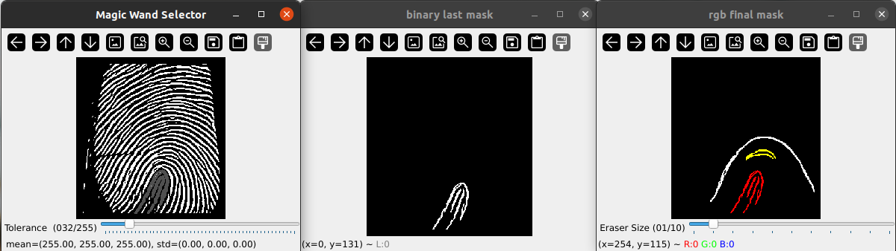

## iLabel

Segmentation mask creator tools for labeling fingerprint images.for trainig segmentation model to featch minutiae points



## Getting Started

Install into a Python virtual environment, as you would any other Python project.

```sh
$ python3 -m venv venv
$ source venv/bin/activate
(venv) $ pip install git@github.com:Hamzeluie/iLabel.git
```
it has three window as you can see in the images

# Magic Wand Selector
 
# binary last mask: 

# rgb final mask:

